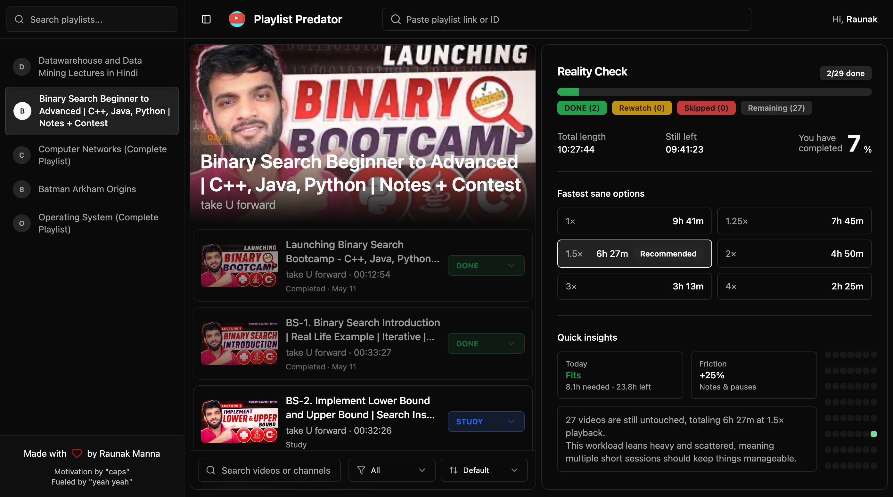

# 🐺 Playlist Predator

> Turn YouTube playlists into something you can actually conquer.

[](https://deepwiki.com/RaunakDiesFromCode/Playlist-Predator)

Playlist Predator converts messy YouTube playlists and chaptered videos into a clean study and watch system. It shows how long a playlist or chapter breakdown really is, how long it will take at different playback speeds, and helps you track what you have done, skipped, or want to rewatch.

It works without login using local storage, and upgrades to Supabase sync when you sign in. The app also includes a saved-playlists sidebar, password reset flows, an admin dashboard, offline support via a service worker, a playlist-aware AI study assistant (PredAI), and a learning insights dashboard.


 <sup>(Playlist: [Binary Search Beginner to Advanced | C++, Java, Python | Notes + Contest](https://www.youtube.com/playlist?list=PLgUwDviBIf0pMFMWuuvDNMAkoQFi-h0ZF))</sup>

---

## ✨ Features

* 🎯 Playlist and video analysis
  Total videos, total duration, remaining time, and speed-based estimates for playlists, plus chapter extraction for single videos with timestamps in the description.

* ✅ Progress tracking
  Mark videos as `DONE`, `SKIP`, `REWATCH`, or clear them back to `NONE`.

* 🔍 Search, filter, and sort
  Search videos by number, title, or channel. Filter by status. Sort alphabetically, by duration, or by creation date.

* 📊 Activity heatmap
  56-day completion heatmap showing your study consistency at a glance.

* ⚡ Optimistic updates
  Progress changes feel instant, with local caching for resilience.

* 🎬 Chapter extraction
  Single video links can be turned into chapter-style playlist rows when timestamps are present in the description.

* 🎥 Enhanced video player
  Video player with navigation controls, description viewing, and improved YouTube integration.

* 👤 Local-first auth flow
  Guests keep progress in local storage; signed-in users sync through Supabase.

* 💾 Saved playlists
  Logged-in users automatically save playlists or video-derived study sets they open, including title, thumbnail, and YouTube link.

* 📚 Playlist sidebar
  Quick access to saved playlists, with search and loading states. Newly opened items appear immediately and stay visible as you change progress states.

* 🗑 Playlist deletion
  Delete saved playlists from the sidebar 3-dot menu. Removes the playlist record, all associated progress data, and cached metadata. Redirects to home if the deleted playlist is currently open.

* 🔒 Account recovery
  Login, register, forgot-password, and reset-password flows are built in.

* 🛡 Admin dashboard
  `/admin` is available for configured admin emails or users with the `admin` role.

* 📶 Offline support
  The app ships with a service worker, precached assets, and an offline fallback page.

* 🌙 Dark mode
  Uses the standard light/dark theme tokens from the app shell.

* 🤖 PredAI — Playlist-aware study assistant
  AI chat assistant that knows your playlist context, progress, and study plan. Supports web search for content-related questions and maintains conversation history.

* 📈 Learning insights
  `/insights` dashboard with completion rates, progress breakdowns, playlist rankings, recent activity, and learning summaries across all your playlists.

* 📤 Export progress
  Copy playlist progress as JSON or CSV to the clipboard.

* 🔢 Versioning support
  Automatic version tracking with auto-generated version file and version display in the navbar.

* 🆚 Playlist comparison
  Compare up to 4 playlists side-by-side with detailed metrics and side-by-side video viewing.

* 📊 Activity heatmap
  56-day completion heatmap showing your study consistency at a glance.

* ⚡ Optimistic updates
  Progress changes feel instant, with local caching for resilience.

* 🎬 Chapter extraction
  Single video links can be turned into chapter-style playlist rows when timestamps are present in the description.

* 🎥 Enhanced video player
  Video player with navigation controls, description viewing, and improved YouTube integration.

* 🔢 Versioning support
  Automatic version tracking with auto-generated version file and version display in the navbar.

* 👤 Local-first auth flow
  Guests keep progress in local storage; signed-in users sync through Supabase.

* 💾 Saved playlists
  Logged-in users automatically save playlists or video-derived study sets they open, including title, thumbnail, and YouTube link.

* 📚 Playlist sidebar
  Quick access to saved playlists, with search and loading states. Newly opened items appear immediately and stay visible as you change progress states.

* 🗑 Playlist deletion
  Delete saved playlists from the sidebar 3-dot menu. Removes the playlist record, all associated progress data, and cached metadata. Redirects to home if the deleted playlist is currently open.

* 🔒 Account recovery
  Login, register, forgot-password, and reset-password flows are built in.

* 🛡 Admin dashboard
  `/admin` is available for configured admin emails or users with the `admin` role.

* 📶 Offline support
  The app ships with a service worker, precached assets, and an offline fallback page.

* 🌙 Dark mode
  Uses the standard light/dark theme tokens from the app shell.

* 🤖 PredAI — Playlist-aware study assistant
  AI chat assistant that knows your playlist context, progress, and study plan. Supports web search for content-related questions and maintains conversation history.

* 📈 Learning insights
  `/insights` dashboard with completion rates, progress breakdowns, playlist rankings, recent activity, and learning summaries across all your playlists.

* 📤 Export progress
  Copy playlist progress as JSON or CSV to the clipboard.

---

## 🛠 Tech Stack

* Next.js App Router
* TypeScript
* Tailwind CSS + shadcn/ui
* Supabase for auth and Postgres-backed sync
* YouTube Data API for playlist and video metadata
* OpenRouter (PredAI) for AI chat
* Tavily for web search
* Sonner for toast notifications
* Vercel for deployment and analytics

---

## ⚙️ How It Works

* Playlist analysis happens on the server in `src/app/[playlistId]/page.tsx`, which fetches playlist metadata or single-video metadata and computes durations.
* Single-video inputs are parsed from the YouTube URL and chapter timestamps are extracted from the description when available.
* Progress is local-first. Guests read and write to local storage, while signed-in users merge local state with server state from `/api/progress`.
* Saved playlists are written through `/api/playlists` when a signed-in user opens a playlist or chaptered video, and the sidebar cache is updated immediately.
* Password reset uses Supabase email recovery, then returns through `/auth/callback` to `/reset-password`.
* The service worker in `public/sw.js` precaches the app shell and serves `/offline.html` when navigation requests fail.
* PredAI builds server-side context from playlist metadata, progress, and study plan, then streams responses from OpenRouter with optional web search via Tavily.

---

## 📡 API Routes

All API routes require authentication.

* `POST /api/playlist/analyze` — Accepts `{ playlistUrl }` and returns playlist metadata plus the analyzed video list. Playlist URLs return playlist rows; single video URLs can return chapter rows when description timestamps are present.
* `GET /api/playlists` — Returns saved playlists for the signed-in user.
* `POST /api/playlists` — Saves a playlist for the current user.
* `DELETE /api/playlists?youtubePlaylistId=...` — Deletes a playlist and all its progress data. Redirects to home if the deleted playlist is currently active.
* `GET /api/progress?playlistId=...` — Returns saved progress for the current user.
* `PATCH /api/progress` — Upserts a single video status. Accepts `{ playlistId, videoId, status }` where status is one of `NONE`, `DONE`, `REWATCH`, `SKIP`.
* `POST /api/comparison` — Accepts `{ inputs: string[] }` (at least 2 playlist URLs/IDs) and returns side-by-side comparison data.
* `POST /api/predai` — PredAI chat endpoint. Accepts `{ messages, playlistId, initialData?, initialProgress? }` and streams back AI responses via SSE.
* `GET /api/predai/history?playlistId=...` — Returns conversation history for a playlist.
* `POST /api/predai/message` — Saves a chat message. Accepts `{ conversationId, role, content }`.
* `GET /api/admin/me` — Returns `{ canAccess: boolean }` for the current user.

---

## 🚀 Getting Started

Install dependencies and start the dev server:

```bash
npm install
npm run dev
```

Create a `.env.local` file with the variables you need:

```env
YOUTUBE_API_KEY=your_youtube_api_key
NEXT_PUBLIC_SUPABASE_URL=https://xyz.supabase.co
NEXT_PUBLIC_SUPABASE_ANON_KEY=your_anon_key
NEXT_PUBLIC_SITE_URL=http://localhost:3000
ADMIN_EMAILS=admin@example.com
SUPABASE_SERVICE_ROLE_KEY=your_service_role_key
OPENROUTER_API_KEY=your_openrouter_api_key
PREDAI_MODEL=openai/gpt-oss-120b:free
TAVILY_API_KEY=your_tavily_api_key
```

Notes:

* `YOUTUBE_API_KEY` is required for server-side playlist analysis.
* Supabase keys are required for auth and cloud sync.
* `NEXT_PUBLIC_SITE_URL` is used by the password reset flow.
* `ADMIN_EMAILS` or `NEXT_PUBLIC_ADMIN_EMAILS` enables admin access checks.
* `SUPABASE_SERVICE_ROLE_KEY` is only needed for the admin dashboard's privileged queries.
* `OPENROUTER_API_KEY` and `PREDAI_MODEL` are required for PredAI chat.
* `TAVILY_API_KEY` is required for PredAI web search.

---

## 🧪 Development Notes

* Playlist analysis lives under `src/lib/youtube`.
* Progress merging and persistence live under `src/lib/progress` and `src/lib/storage/progress`.
* Supabase server/client helpers are in `src/lib/supabase`.
* Admin access checks are in `src/lib/admin/access.ts`.
* PredAI context, search, and DB layer are in `src/lib/predai`.
* Insights calculations are in `src/lib/insights`.
* The main app routes are in `src/app`, including `/admin`, `/login`, `/register`, `/forgot-password`, `/reset-password`, `/compare`, and `/insights`.

If you change environment variables, restart the dev server.

---

## 🧩 Usage

1. Paste a YouTube playlist link or ID, or a normal video link, on the homepage.
2. The app analyzes the playlist or extracts chapters from the video description, then shows total duration, remaining time, and speed-adjusted estimates.
3. Mark videos as done, skipped, or rewatch as you move through the playlist.
4. Search, filter, and sort videos to find what you need.
5. Sign in if you want progress and saved playlists to sync across devices.
6. Use PredAI to ask questions about your playlist content and get study recommendations.
7. Check `/insights` for a cross-playlist view of your learning activity.

---

## Contributing

Contributions are welcome. Keep changes focused and add tests where appropriate.

---

## License

Licensed under the MIT License. See `LICENSE`.

---

*Forked from Aymaan Shabbir's [Playlist Predator](https://github.com/Aymaan-Shabbir/Playlist-Predator)*

*Special thanks to [Dipannita Sharma](https://github.com/dipannitasharma)*
